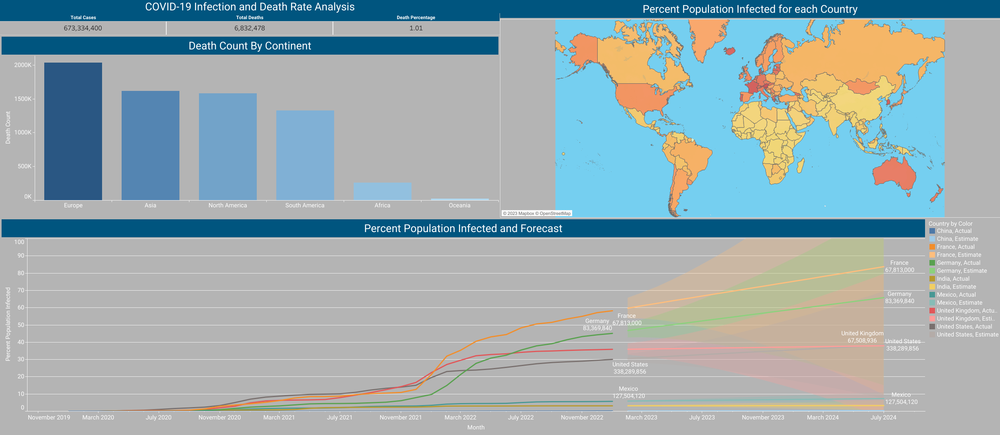

# SQL Data Exploration and Visualization in Tableau

#### This project is a work in progress

## Exploration

As practice in using SQLServer I did this data exploration project using SSMS and SQLServer 2019 Express.

The main questions that I wanted to answer are as follows
1. What countries have the lowest death rate from Covid-19 infections?
2. Where in the world is the highest percentage of population that has been infected?
3. What does the future of Covid-19 infection look like across the globe?

The dataset contains records regarding the COVID-19 pandemic and this project mainly focuses on the number of people infected and vaccinated.
It can be found and downloaded [here](https://ourworldindata.org/covid-deaths).

First the data needed to be cleaned and split into two tables.
One containing data regarding the number of infected individuals and the second the other of vaccinated individuals.

The data was then read into SSMS and queries were written to answer the above questions and more.

## Visualization

After writing some queries that yielded good results for visualization I extracted some tables and read them into Tableau.

I then created the following dashboard that focuses mainly on infection and death rates.

